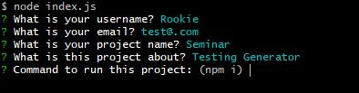
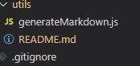
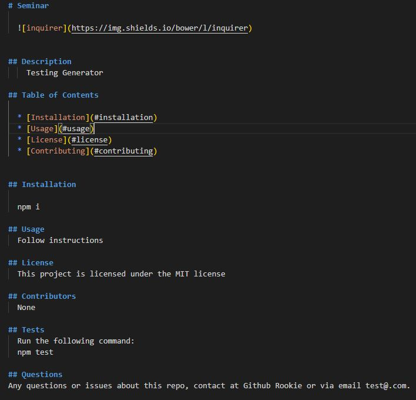

# README-Generator
 
## Description 
  
As a developer, it is crucial to include an informative README about the project. This information includes a short description of what the application is for, how to use, install, and make contributions to project. Based on the quality of the README, it is more likely that other developers will use and contribute to the project. Creating a good README from scratch takes time, but the purpose of this project is to quickly generate a README through command-line and allow the developer(s) to focus more on completing their project rather than writing a good README.


## Table of Contents

 * [Installation](#installation)
 * [Usage](#usage)
 * [Tests](#Test)
 * [Author](#Author)
 
  

## Installation
Before installing this project, be sure to have node.js installed first.

Install this project by running the following command:
  ```javascript
npm i inquirer

  ```

## Usage
After running the installation command, na

Next, run ```node index.js``` and answer the questions as follows which will pass the data to the README.




Once completed, a README.md is generated in the /utils folder




The user's answers is then appended in the syntax of the README file.



## Tests


## Author

[lu-gflores](https://github.com/lu-gflores)

  